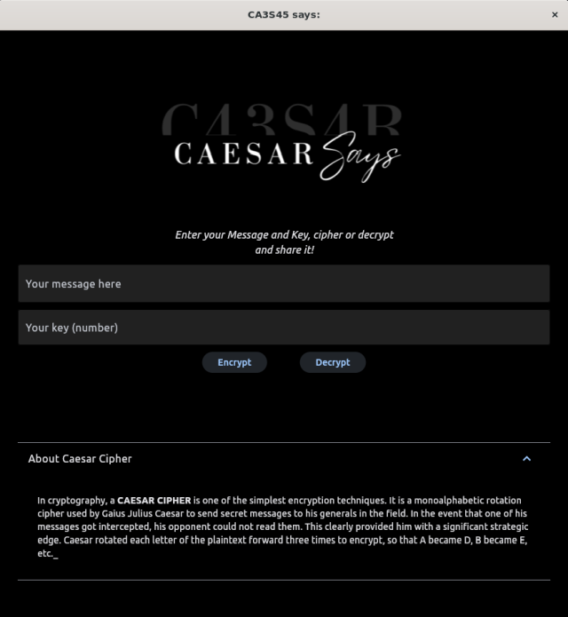

# caesar_says
A _Caesar Cipher_ application, introducing my first steps with Flet. This classic Caesar cipher allows users to introduce a key, encrypt their text and share the encrypted text via WhatsApp. They can decryt it if they have the key!

### INTERFACE
  * Two TextFields: one for entering the text and the other for entering the key.
  * Two Buttons: "Encrypt" and "Decrypt".
  * A third Button for sharing, wich becomes visible when the user encrypts or decrypts the text.

    

### LIBRARIES
* _flet_
* _webbrower_
